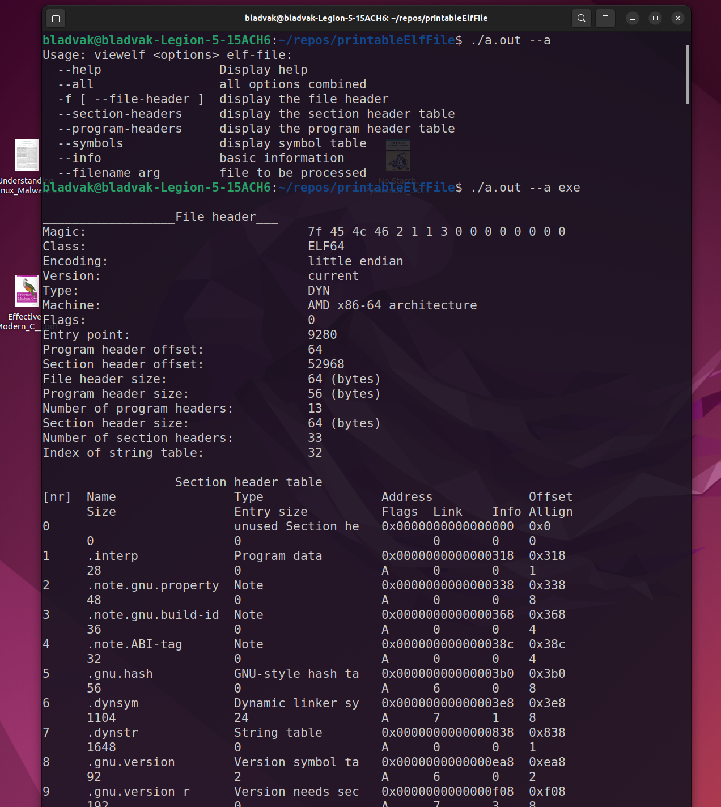

### ABOUT 
Displays information about object files(ELF)
(under constant development)

The idea behind this project is based on the readelf tool from GNU binutils. Output might look like the one produced by readelf, but I will (probably) not implement all of its functionality. That being said, this project will include some of the more sophisticated functionalities, e.g. detecting if the file is packed by analysing code patterns near the file's entry point.

### BUILT WITH
Written using STL. For cmd line arguments processing boost/program_options was used.

### Additional requirements
* GNU's elf.h or any other that defines standard ELF types, structures, and macros.
* boost/program_options

### USAGE
```
Usage: viewelf <options> elf-file:
  --help                Display help
  --all                 all options combined
  -f [ --file-header ]  display the file header
  --section-headers     display the section header table
  --program-headers     display the program header table
  --symbols             display symbol table
  --info                basic information
  --filename arg        file to be processed
  ```

  ### Sample output
  